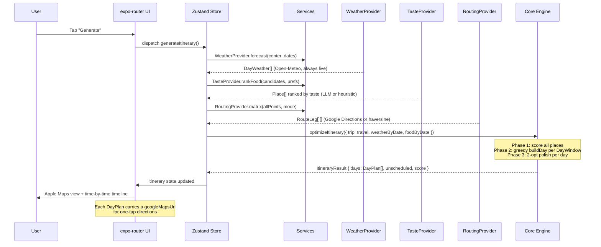

# Architecture

Gnaver is structured in four clean layers with a strict dependency direction: UI → Store → Services → Core. The core engine has zero React Native imports — it is plain TypeScript that runs identically in Node tests and on-device.

---

## Layer Overview

```
┌─────────────────────────────────────────────────────────────────┐
│  📱  expo-router UI  (src/app/ + src/components/)               │
│  Screens, navigation, native Maps view, timeline list,          │
│  place-selection UI. Reads from and writes to the Zustand store. │
├─────────────────────────────────────────────────────────────────┤
│  🗂️  Zustand Store                                               │
│  Single reactive state tree: current trip, place selection,      │
│  generated itinerary, loading/error flags.                       │
│  Dispatches async actions that call into Services.               │
├─────────────────────────────────────────────────────────────────┤
│  🔌  Services  (src/services/)                                   │
│  Provider pattern — each service has a live and a mock           │
│  implementation.  config.ts selects the live one when an API     │
│  key is present, falling back to mock automatically.             │
│                                                                  │
│  PlacesProvider  · RoutingProvider · WeatherProvider             │
│  · TasteProvider                                                 │
├─────────────────────────────────────────────────────────────────┤
│  ⚙️  Pure Core Engine  (src/core/)                               │
│  No RN imports. Fully unit-tested. Deterministic, synchronous.   │
│  types · optimizer · constraints · recommender                   │
│  geo · googleList · googleMaps · currency · time                 │
└─────────────────────────────────────────────────────────────────┘
```

---

## Core Modules

### `types.ts` — Domain Model

The single source of truth for every shape in the system. Key interfaces:

| Type | Description |
|---|---|
| `Place` | A visitable location: coords, category, interests, opening hours, price info, weather sensitivity, dwell time |
| `Trip` | The user's trip: days, candidate places, preferences (interests, transport, pace, food, weather) |
| `DayWindow` | One day's time window with optional custom start/end location |
| `TripPreferences` | Interests, transport mode, pace, food budget, cuisine prefs, dietary needs, weather thresholds |
| `DayPlan` | Optimizer output for one day: ordered `ScheduledStop[]`, total cost, total distance, Google Maps URL, weather |
| `ScheduledStop` | One stop: place, arrival/departure in minutes-from-midnight, travel leg, warnings |
| `ItineraryResult` | Full trip result: `DayPlan[]`, unscheduled places, total score |
| `OpeningHours` | Weekly schedule by day-of-week + `OpeningException[]` for holidays / ceremonies |
| `PriceInfo` | Entry price, currency (ISO 4217), accepted payment methods, notes |

### `optimizer.ts` — Scheduling Engine

See [How the Optimizer Works](#optimizer-algorithm) below.

### `constraints.ts` — Opening Hours + Weather

- `openRangesForDate(hours, isoDate)` — resolves `OpeningHours` to concrete `TimeRange[]` for a date, applying exceptions first (holiday closures override the weekly schedule)
- `evaluateVisit(hours, date, arrival, dwell, dayEnd)` — returns feasibility, entry time (waiting if we arrive before opening), departure time, and a rejection reason
- `weatherImpact(place, weather, prefs)` — returns a value multiplier `[0.2, 1.1]` and warning strings; indoor places gain value on bad weather days, outdoor places lose it

### `recommender.ts` — Heuristic Food Ranker

`scoreFood(place, prefs)` combines:
- Star rating (dominates at 2× weight)
- Review count (log-scaled popularity)
- Cuisine keyword matches in name/description/tags (`+1.5` per match)
- Dietary support keywords (`+1.2`); obvious dietary conflicts penalised (`-1.5`)
- Budget tier distance (`-1.2` per tier away from preference)

`rankFoodHeuristic` sorts candidates best-first. The `TasteProvider` uses this output as a pre-ranking step before optionally asking an LLM to reorder a short list.

### `geo.ts` — Travel Estimation

`estimateLeg(from, to, mode)` computes a synchronous `RouteLeg` using haversine distance × 1.3 detour factor ÷ per-mode speed:

| Mode | Speed | Overhead |
|---|---|---|
| walk | 80 m/min (~4.8 km/h) | 0 min |
| bike | 230 m/min (~13.8 km/h) | 1 min |
| transit | 300 m/min (~18 km/h) | 6 min |
| drive | 380 m/min (~22.8 km/h) | 5 min |
| mixed | walk if ≤1 100 m, else transit | — |

The `RoutingProvider` replaces these estimates with real Google Directions data when a key is present.

### `googleList.ts` / `googleMaps.ts`

Pure URL utilities. `classifyGoogleUrl` distinguishes list / place / directions / short links. `parseCoordsFromUrl` extracts `LatLng` from `!3d…!4d…`, `@lat,lng`, and `?q=` forms. `buildDirectionsUrl` constructs multi-waypoint Google Maps deep-links using the path form (no 9-waypoint cap).

### `currency.ts` / `time.ts`

Formatting utilities. All time values throughout the system are **minutes from local midnight** (e.g. 09:30 = 570). ISO `yyyy-mm-dd` dates are treated as destination-local, never converted through `Date` timezone logic.

---

## Optimizer Algorithm

### Phase 1 — Value Scoring

```
baseValue(place, prefs) =
  10 × interestFactor × (0.55 + 0.6 × ratingScore)
  + popularityBonus
  × (3 if mustSee else 1)
```

`interestFactor` is `0.5 + overlap/min(3, interests.length)` — places sharing more of the user's interests score higher without penalising niche interests too harshly. `weatherImpact` then scales this value up or down before the greedy loop uses it.

### Phase 2 — Greedy Forward Construction (`buildDay`)

```
time ← window.startMinutes
pos  ← startLocation ?? highest-value place location

loop (guard ≤ 60 iterations):
  if lunch window and not eaten lunch:
    pick meal within MAX_FOOD_DETOUR_MIN (25 min)
  if dinner window and not eaten dinner:
    pick meal
  best ← argmax over unused places of:
    adjValue / max(15, travelMinutes + waitMinutes + dwellMinutes)
  if no feasible best: break
  append best; advance time and pos
```

`tryStop` checks:
1. Walk-distance limit (`maxWalkMinutes`)
2. `evaluateVisit` — opening hours + day window
3. Ability to still reach `window.endLocation` in time

### Phase 3 — 2-opt Polish (`twoOpt`)

```
for up to 8 rounds:
  for each pair (i, k) of non-food stops:
    reverse the segment [i..k] in the ordering
    simulate the full day with this ordering
    if feasible and total travel < current best:
      adopt this ordering
```

Only the attraction ordering is changed. Food stops are held in their time-anchored positions.

### Constraint Model

| Constraint | Where enforced |
|---|---|
| Opening hours (weekly) | `openRangesForDate` + `evaluateVisit` |
| Holiday / ceremony closures | `OpeningException.closed = true` overrides weekly |
| Partial-day hours (e.g. morning only) | `OpeningException.ranges` overrides weekly |
| Day time window (start/end minutes) | `evaluateVisit` checks `depart ≤ dayEnd` |
| Custom end location | `tryStop` checks reach to `window.endLocation` |
| Walk distance limit | `tryStop` rejects legs exceeding `maxWalkMinutes` |
| Weather — rain avoidance | `weatherImpact` multiplier < 1 for outdoor places |
| Weather — temperature thresholds | `avoidOutdoorAboveC` / `avoidOutdoorBelowC` in prefs |
| Meal timing | Lunch 12:00–14:30, Dinner 18:30–21:00 windows |
| Meal detour | `MAX_FOOD_DETOUR_MIN = 25` minutes; falls back to any feasible |
| "Closing soon" warning | Emitted if departure is within 20 min of closing edge |

---

## Data Flow — Generate Itinerary



---

## Design System

The design system is defined in [`src/theme/tokens.ts`](../src/theme/tokens.ts) as the "Map-first Minimal" theme:

- **Surfaces**: white / graphite (`#15191E` dark background)
- **Single accent**: electric blue `#0A84FF` (light) / `#3D9BFF` (dark)
- **Food pin**: `#FF7A00`
- **Typography**: SF Pro (System font on iOS), 4-pt spacing scale
- **Glass cards**: `rgba(255,255,255,0.72)` over the full-bleed map
- **Motion**: spring physics (`damping: 18, stiffness: 200`) via `react-native-reanimated 4.3.1`
